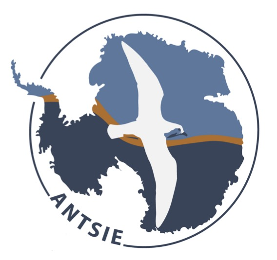

<!-- README.md is generated from README.Rmd. Please edit that file -->

# nektonAES

This repository contains code and data for the analysis of Southern
Ocean micronekton distributions and forms part of the
[ANTSIE](https://antsie.webspace.durham.ac.uk) project.

The outputs from this analysis contribute to the manuscript “Protecting
climate refugia to strengthen Southern Ocean resilience”
